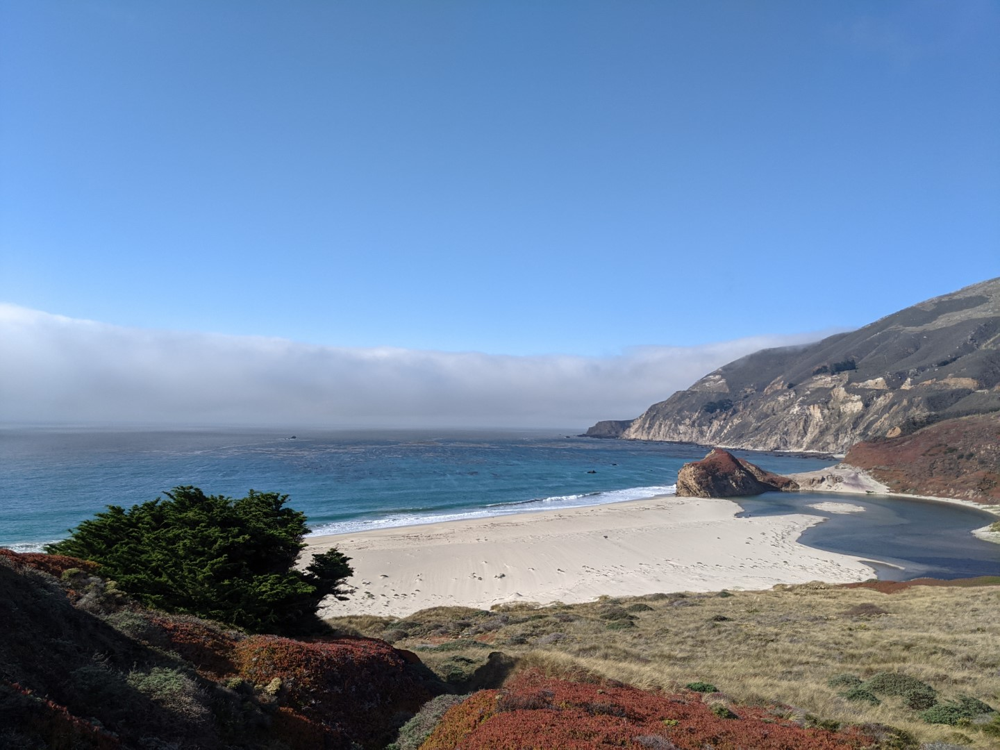
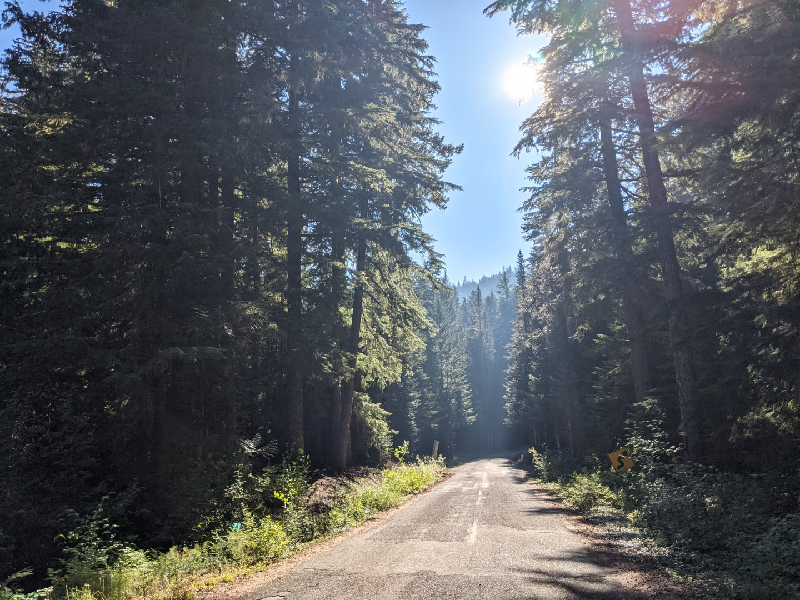
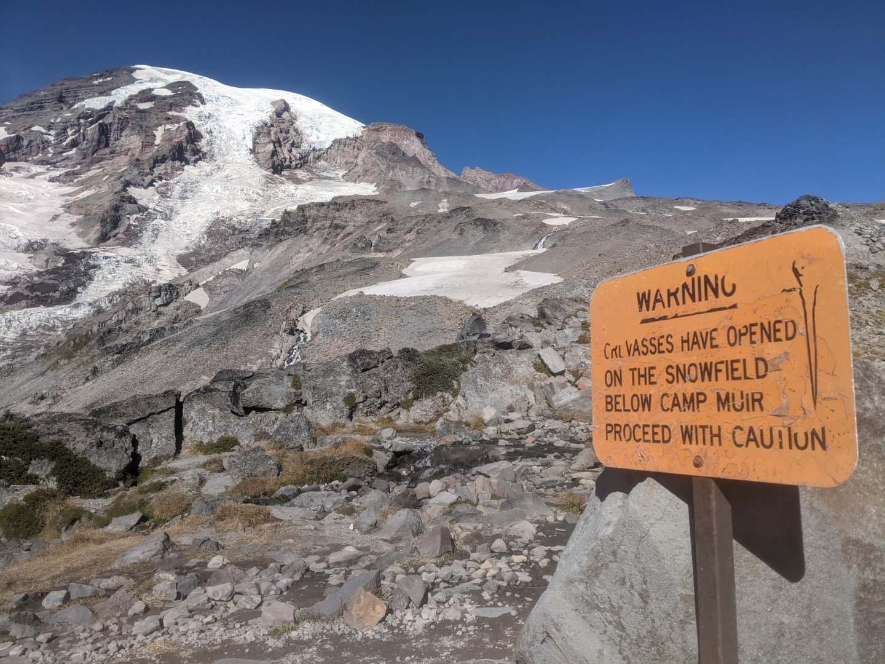
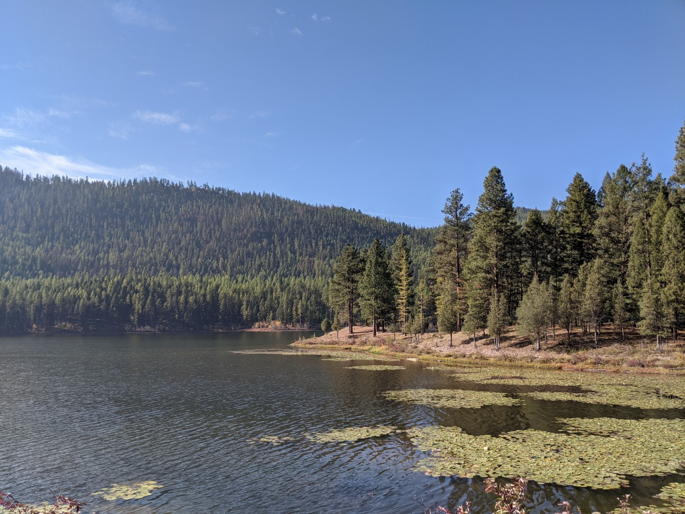
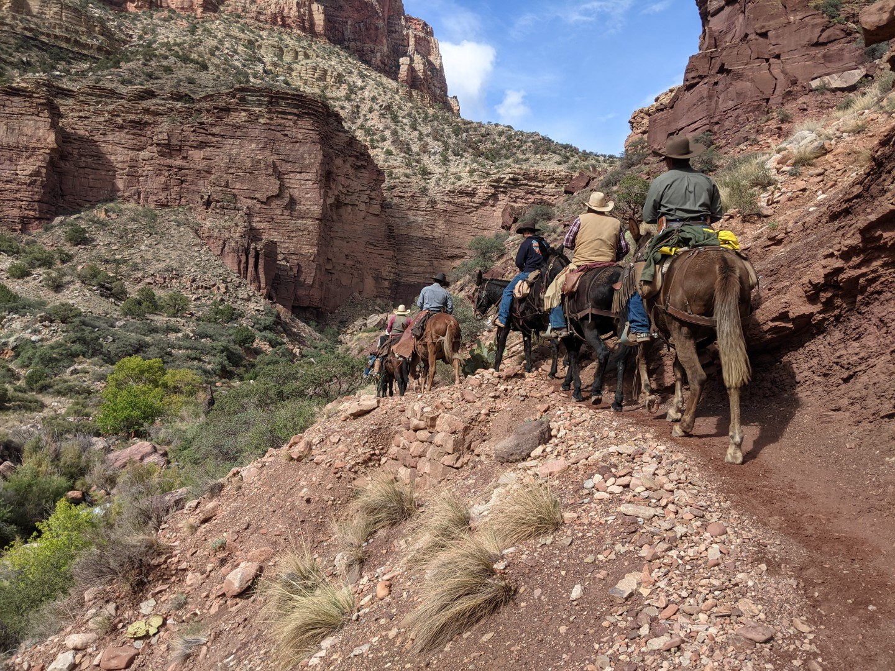

20 days, 6000 miles

DAY 1 - Arlington, TX to Albuquerque, NM
------------------------

Headed out around 7 AM. Drive was uneventful, didn't think to take pictures. Got to Albuquerque in the afternoon and checked into a hostel.

DAY 2 - Albuquerque, NM to Monticello, UT
------------------------

Woke up at 3 AM for the Balloon Fiesta, Albuquerque's annual hot air balloon festival. (When I decided to go to Albuquerque, I didn't realize this festival was happening. Happy accident.) Waited in a parking lot with thousands of other people for buses to pick us up. It was surprisingly smooth; they've been doing this for 50 years, so I guess they've got the logistics figured out.

Got to the festival grounds and waited a few hours for stuff to start.

If the weather's bad, they'll cancel the events for the day. (But the festival is 9 days, so cancelling 1 day isn't a big deal.) It was looking like they were going to cancel. While we were waiting, I made friends with an older couple. She's a photographer and he's a software architect. 

Eventually the wind settled down and they started inflating the balloons.

Eventually everyone was going up. Hundreds and hundreds, all different types.

Left the festival and drove up to Utah.

I booked a campsite in Canyonlands National Park in Utah. By the time I got to the park, a storm started rolling in. It was looking pretty ominous but I kept going.

Eventually it started storming hard and the road flooded. I considered leaving so I wouldn't get stranded. I didn't have cell service so I drove backwards 20 miles until I had service, just so I could check the weather. It looked like it was supposed to clear up in a few hours, so I decided I'd wait by the flooded road until the storm cleared.

I drove back down and the storm kept getting worse. The lightning was intense and I was nervous being in my car. So I drove to a nearby camp bathroom and stayed in there for a few hours. Eventually the storm stopped, but the road was so muddy I couldn't cross (my rental car is 2-wheel drive.) They brought a bulldozer in to clear the road and after a while I was able to cross.

After a 4 hour delay I finally got to the campsite.

DAY 3 - Monticello, UT to Salt Lake City, UT
------------------------

The main reason I picked this campsite was because it was right at the base of some rocks I wanted to climb. So in the morning, I got started in hopes of seeing the sunrise from the top of the rocks.

I climbed the first half pretty easily.

But to get to the top was going to be harder. There was no obvious way up that didn't involve risky climbs. Eventually I picked a route and went. At one point I went out onto a ledge above a steep drop (a fall would have been... very bad.) At first I wasn't worried, but then the ledge stopped and I had no choice but to go straight up onto a smooth section with no good grips. I tried to go backwards the way I came, but I felt like I was losing my balance and about to fall. So I had no choice but to go for it. One of the scariest moments of my life.

But I made it and got to the top. I was able to find a safer route down the other side.

Left the campsite and passed back by the bathroom I had stayed in during the storm.

Headed toward Salt Lake City. The drive was beautiful. The desert slowly turned into hills with aspens.

Instead of satying on the interstate, I decided to take a longer scenic route through a national park.

This route passed by a lake with some people fishing.

Got to Salt Lake City and checked into a hostel. Decided to go downtown and see some Mormon things.

(The temple is under construction I guess?)

Drove to a hill overlooking the city and hiked up it to get a good view. According to a plaque, Brigham Young went up this hill when he was deciding whether to settle on this land.

DAY 4 - Salt Lake City, UT to Las Vegas, NV
------------------------

I slept in late, first good night of sleep I've had so far. Originally I was planning to stay in Salt Lake City another day and then go west, but I decided instead to leave today and go south. I was curious to see Las Vegas, and I really wanted to camp in Joshua Tree.

So I headed southwest toward the corner of Utah, Arizona, and Nevada.

The drive was gorgeous. The grassy mountains of Utah slowly morphed into rock as I got into Arizona.

But as soon as I hit Nevada, it became flat desert.

Got into Las Vegas and went to see the strip. It was a lot. Didn't really do anything there, just looked around and stayed long enough to get the idea.

Ended the night at a dance club in a calmer part of town.

DAY 5 - Las Vegas, NV to Joshua Tree, CA
------------------------

Headed south toward Joshua Tree. Stopped at a small casino on the way out of town. Went in with $20, came out with $40.65!

Happened to pass by the Hoover Dam, so stopped there to look.

Kept driving and passed by a cool mountain right next to the highway. So I decided to see if there was a trail to it, and there was!

Decided to climb up it, which was hard because it was mostly loose rocks the whole way up. Accidentally found a geocache also!

Got close to the top where some climbing was needed, and couldn't find a way past this boulder. It didn't look very stable, so I decided to admit defeat and head back down.

But it was a cool view even without getting to the very top:

Got dinner at a swanky golf club.

Kept driving toward Joshua Tree.

Didn't get there until night, so it was hard to get good photos.

DAY 6 - Joshua Tree, CA to Santa Barbara, CA
------------------------

Slept very poorly, so decided to take the day slow and not do much other than drive.

LA traffic was miserable and the gas station coffee was even worse than usual, but the drive was fine. Got to the beach in the early afternoon.

Got dinner and headed to the Airbnb early.

DAY 7 - Santa Barbara, CA to Carmel by the Sea, CA
------------------------

Spent the day driving up Highway 1 (which is on the coast) and stopping at anything that looked interesting.

At one point I passed the Big Sur "Jade Festival" which, weirdly enough, is exactly what it sounds like: a festival dedicated to art and jewelry made out of jade stones.

Found a cool outcropping that was fun to climb.

The rocks were all loose, so I had a really hard time getting back up to the road after climbing down to see this bridge. I can see why this area is prone to rockslides.

Eventually made it to Carmel by the Sea where I stayed for the night.

DAY 8 - Carmel by the Sea, CA to Eureka, CA
------------------------

Woke up and drove to Palo Alto to have brunch with <a href="https://www.youtube.com/watch?v=5G9gk49VhKM">Karen Wong</a> and her husband George!

Drove into San Francisco and wandered around the neighborhoods for a while.

The streets are crazy here. Total chaos. I was originally planning to stay one more day in this area, but the traffic and crowds were stressing me out so I decided to leave. Wanted to see the Golden Gate first...

... but the clouds were so low that I really couldn't. Oh well. Hung out for a while at the park right next to the bridge.

The drive north was peaceful after getting out of the city.

Passed a number of vineyards.

Drove in the dark for a while, could tell that the trees were changing into pines but it was hard to see. Got foggy and spooky for a while.

Ended up at a small town Airbnb for the night.

DAY 9 - Eureka, CA to Bend, OR
------------------------

Decided to try to get all the way to Bend, Oregon today, which would be quite a drive. Got started early so I'd have time to stop at stuff along the way.

Like an area that claimed to have wild elk. I didn't find any.

Passed through the Redwood National and State Parks and saw the huge trees. This one is supposedly 1500 years old:

Kept going north into Oregon.

Stopped at a big cats sanctuary:

Then drove the rest of the way to Bend.

The hostel doubles as a bar with live music, and apparently Sunday night is disco night. Might have a tough time getting to sleep...

DAY 10 - Bend, OR to Ashford, WA
------------------------

Woke up this morning and had absolutely no idea where I wanted to go. Decided I wanted to hike Mount Rainier, so I headed north for Washington.

Passed a site called "Pioneer Woman's Grave", a burial site for a woman who died on the Oregon Trail.

Passed Mount Hood:

Had to stop and climb something, of course:

Got off the highway and took an unpaved route through the mountains, which was slower but beautiful.

The campsites at the base of Mount Rainier are closed for the season, so I found a nearby inn.

DAY 11 - Ashford, WA to Seattle, WA
------------------------

Woke up early and got to the base of Mount Rainier. Was hoping to see sunrise from a good view.

And I did! Pictures don't capture it very well... it was the most beautiful sunrise I've ever seen.

Started hiking up. I knew I wouldn't be able to get to the very top of the mountain (you have to hire a guide, it's pretty difficult and icy) but I was hoping to get to the base camp they use when summiting.

The first part of the trail wasn't too bad. Just a normal hike. But then the ice fields started...

I was able to go around some of them, but eventually I had to cross some. It wasn't too bad. Imagine a mogul ski run, but ice:

They were pretty brutal to cross (especially without shoe spikes and poles) but I made it. Had to grab rocks and sort of dig them into the ice to get traction on steeper parts. Then there was a long stretch of scrambling (hiking up rocks, sometimes having to climb a little bit.) Almost gave up but eventually made it to the camp.

The hike back was a little easier because I could slide down the ice, almost like skiing. Full hike was 9.4 miles, 7 hours, 4,800 feet of elevation.

Drove to Seattle afterward to stay with a buddy.

DAY 12 - Seattle, WA
------------------------

My buddy worked today so I just hung out at his apartment until the evening. Nice to have some rest. We went into downtown Seattle for a while and just wandered around.

DAY 13 - Seattle, WA to Columbia Falls, MT
------------------------

Headed for Montana. It was a long drive so I didn't really stop to take many photos.

A friend happened to be visiting the same area today for an event, so I showed up for a while. It was a church hosting a Beast Feast. Can't really tell from the picture, but it was a huge turnout:

Stayed at a quirky "treehouse" Airbnb: 

DAY 14 - Columbia Falls, MT to Lava Hot Springs, ID
------------------------

Originally I was planning to keep going east into North Dakota or South into Wyoming, but my mind was really stuck on the Grand Canyon, which I had bypassed on day 5. I decided to head south just to see the Grand Canyon.

So for today, that meant driving halfway and stopping somewhere in Idaho.

I wanted to go to a hot springs, so I went to a little town called Lava Hot Springs. Hung out there for a while and talked with some locals about their lives. It was a good time.

DAY 15 - Lava Hot Springs, ID to Grand Canyon, AZ
------------------------

Drove the rest of the way to the Grand Canyon. Didn't stop at all to take photos.

I was hoping to take a hike into the canyon, or even go camping down there. But people normally have to make reservations months in advance (and win a "lottery" because demand is higher than availability) in order to get a campsite. They do set aside a few spots for spur-of-the-moment people like me, but it's first-come-first-serve so you have to get lucky. I figured I'd give it a shot.

Turns out, I was able to get 2 consecutive nights at 2 different campsites, which meant I would be able to do a "rim to rim" hike 24 miles all the way across the canyon. The only catch is, I'd have to leave my car at the north side and finish at the south side, and somehow get back to my car (a 5 hour drive, because you have to drive all the way around the canyon.) But I was able to reserve a spot on a shuttle bus.

So I drove an hour to the nearest town and got some supplies and stayed at a motel.

DAY 16 - Grand Canyon, AZ
------------------------

Started midday, only needed to go 7 miles downhill. Expected it to be a pretty easy day, and it was.

Hiked the first couple hours with a guy named Will who was just doing a day hike partway down.

There was more vegetation than I expected. Lots of plants and trees, and a river running along the whole trail.

The pictures don't do it justice, but the walls looked so incredibly high from down there.

Groups of tourists sometimes passed on mules. These people all looked scared... from what I heard, it's pretty nerve-racking to ride these mules because you feel like you could get thrown off the cliff at any moment. Some parts of the trail are right on the edge of a long, long drop.

Got to the first campsite. There was a building there with some equipment for park rangers. There was even a helipad on the roof so that helicopters could land safely. I guess they bring supplies on helicopters and also pick people up in emergencies (like if a hiker gets heat stroke and can't move anymore.)

Rained a bit at night, but wasn't a big deal. I didn't have a tarp but was able to tie some trash bags together and that was good enough.

DAY 17 - Grand Canyon, AZ
------------------------

Slept surprisingly well, ready for the 12 miles today. Took a short detour to a neat little waterfall:

The further I went, the fewer trees there were. It was starting to look more like what I expected the Grand Canyon to look like.

Passed through a little village at the very bottom of the canyon, sort of like a hotel. Apparently only a small percentage of people win the reservation lottery and are able to stay here. It even had a shop where you could buy food and supplies (and pay with credit card somehow lol; I guess they had satellite internet.) Lots of hikers were taking a break here.

Until this point it was all downhill. This was the very bottom, the muddy and raging Colorado River. The rest of the hike would be uphill. First you had to cross a long, rickety bridge:

The uphill wasn't too steep (yet) but it was definitely harder.

Made it to the campsite around 3 PM, pretty tired. But only 5 miles left to go tomorrow.

DAY 18 - Grand Canyon, AZ
------------------------

Didn't sleep well, was wide awake at 3 AM, so I decided to pack up and try to get to the top to see the sunrise.

This last 5 miles was pretty steep, but it wasn't as bad as I was expecting. Thought it was going to be absolutely brutal, but it wasn't. Got to the top at exactly 6 AM, just in time for the sunrise:

My shuttle bus wasn't coming until 1 PM, so I had some time. This top area is designed for people to come see the views even if they don't want to hike. There were shops and overlooks you could walk to:

Met a guy named Vince who was headed out to do the whole 24 miles in 1 day without stopping to camp. Since he was leaving, he gave me his hotel room key so I could shower (which was awesome, because... I needed it.) Had to wait around for a few more hours and met a couple guys (<a href="https://gracepointchurch.net/mikemcdaniel">Mike</a> and Paul) who turned out to be riding the same 5-hour shuttle bus as me. Had a good time on the shuttle with them and the other people riding with us.

Made a couple scheduled stops along the way, including one at the historic Cameron Suspension Bridge:

Made it back to the car and went back to the same motel from a few days ago.

DAY 19 - Grand Canyon, AZ to Albuquerque, NM
------------------------

Nothing but driving today. Most of it was through the Hopi Reservation and the Navajo Nation.

Got to Albuquerque, stayed in an Airbnb downtown instead of the hostel from day 1.

DAY 20 - Albuquerque, NM to Arlington, TX
------------------------

Final day, nothing but driving. Ironically today was the only day I hit any issues with traffic. Something was blocking all lanes a few hours outside DFW, so I had to wander down some dirt roads to get around it. Made it back just in time for rush hour traffic. But it was nice to be home.
