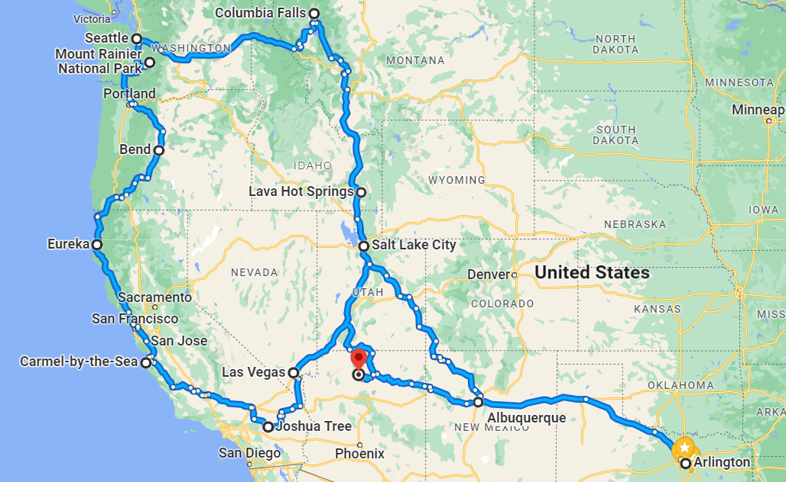
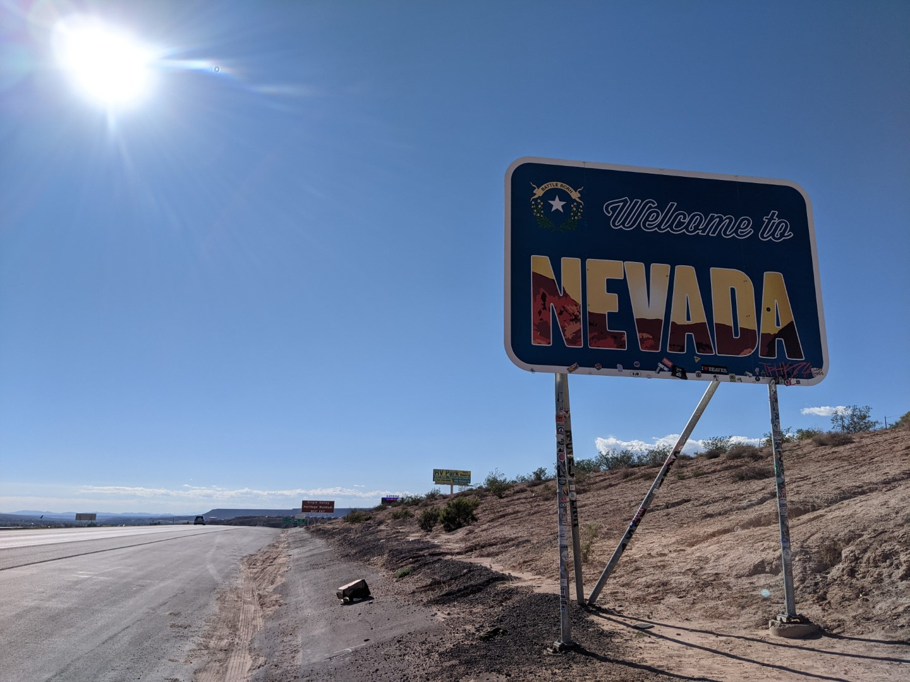

DAY 1 - Dallas, TX to Albuquerque, NM
------------------------

Headed out around 7 AM. Drive was uneventful, didn't think to take pictures. Got to Albuquerque in the afternoon and checked into a hostel.

DAY 2 - Albuquerque, NM to Monticello, UT
------------------------

Woke up at 3 AM for the Balloon Fiesta, Albuquerque's annual hot air balloon festival. (When I decided to go to Albuquerque, I didn't realize this festival was happening. Happy accident.) Waited in a parking lot with thousands of other people for buses to pick us up. It was surprisingly smooth; they've been doing this for 50 years, so I guess they've got the logistics figured out.

Got to the festival grounds and waited a few hours for stuff to start.

If the weather's bad, they'll cancel the events for the day. (But the festival is 9 days, so cancelling 1 day isn't a big deal.) It was looking like they were going to cancel. While we were waiting, I made friends with an older couple. She's a photographer and he's a software architect. 

Eventually the wind settled down and they started inflating the balloons.

Eventually everyone was going up. Hundreds and hundreds, all different types.

Left the festival and drove up to Utah.

I booked a campsite in Canyonlands National Park in Utah. By the time I got to the park, a storm started rolling in. It was looking pretty ominous but I kept going.

Eventually it started storming hard and the road flooded. I considered leaving so I wouldn't get stranded. I didn't have cell service so I drove backwards 20 miles until I had service, just so I could check the weather. It looked like it was supposed to clear up in a few hours, so I decided I'd wait by the flooded road until the storm cleared.

I drove back down and the storm kept getting worse. The lightning was intense and I was nervous being in my car. So I drove to a nearby camp bathroom and stayed in there for a few hours. Eventually the storm stopped, but the road was so muddy I couldn't cross (my rental car is 2-wheel drive.) They brought a bulldozer in to clear the road and after a while I was able to cross.

After a 4 hour delay I finally got to the campsite.

DAY 3 - Monticello, UT to Salt Lake City, UT
------------------------

The main reason I picked this campsite was because it was right at the base of some rocks I wanted to climb. So in the morning, I got started in hopes of seeing the sunrise from the top of the rocks.

I climbed the first half pretty easily.

But to get to the top was going to be harder. There was no obvious way up that didn't involve risky climbs. Eventually I picked a route and went. At one point I went out onto a ledge above a steep drop (a fall would have been... very bad.) At first I wasn't worried, but then the ledge stopped and I had no choice but to go straight up onto a smooth section with no good grips. I tried to go backwards the way I came, but I felt like I was losing my balance and about to fall. So I had no choice but to go for it. One of the scariest moments of my life.

But I made it and got to the top. I was able to find a safer route down the other side.

Left the campsite and passed back by the bathroom I had stayed in during the storm.

Headed toward Salt Lake City. The drive was beautiful. The desert slowly turned into hills with aspens.

Instead of satying on the interstate, I decided to take a longer scenic route through a national park.

This route passed by a lake with some people fishing.

Just for kicks decided to get in the water. It was freezing.

Got to Salt Lake City and checked into a hostel. Decided to go downtown and see some Mormon things.

(The temple is under construction I guess?)

Drove to a hill overlooking the city and hiked up it to get a good view. According to a plaque, Brigham Young went up this hill when he was deciding whether to settle on this land.

DAY 4 - Salt Lake City, UT to Las Vegas, NV
------------------------

I slept in late, first good night of sleep I've had so far. Originally I was planning to stay in Salt Lake City another day and then go west, but I decided instead to leave today and go south. I was curious to see Las Vegas, and I really wanted to camp in Joshua Tree.

So I headed southwest toward the corner of Utah, Arizona, and Nevada.

The drive was gorgeous. The grassy mountains of Utah slowly morphed into rock as I got into Arizona.

But as soon as I hit Nevada, it became flat desert.

Got into Las Vegas and went to see the strip. It was a lot. Didn't really do anything there, just looked around and stayed long enough to get the idea.

Ended the night at a dance club in a calmer part of town.

